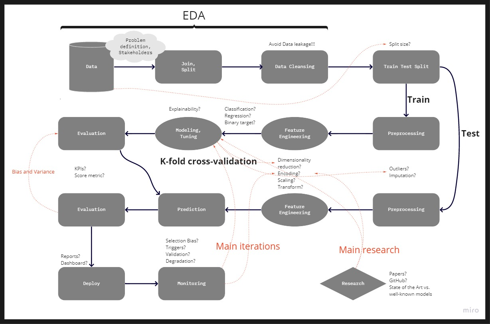
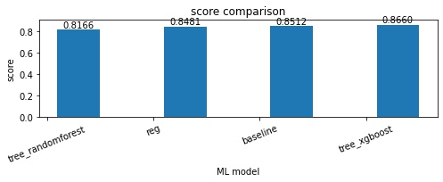
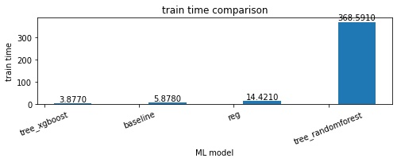
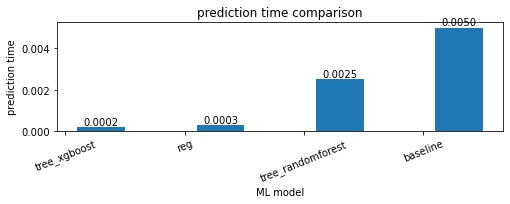

# Demo

## Autor
* [Marcelo B. Barata Ribeiro](https://www.linkedin.com/in/marcelobarataribeiro/)

## Base de dados escolhida
* http://archive.ics.uci.edu/ml/machine-learning-databases/adult/

## Introdução
Devemos pensar sempre pela perspectiva do problema de negócio. O que desejamos resolver? Com essa base de dados, podemos simular que o problema passado pelo cliente/stakeholder seja classificar as entradas da base de dados com o intuito de promover uma campanha específica (de acordo com a classificação de renda de cada pessoa). Para isso, um problema de negócio diz respeito à escolha da métrica apropriada, por exemplo: Acurácia, Precisão, Recall e F1. Tal escolha vai depender do que seria considerado mais custoso: Falso Positivo ou Falso Negativo. Em outras palavras, lançar campanha para um cliente que tem poucas chances de trazer retorno (Falso Positivo) é pior ou melhor do que deixar de lançar campanha para um cliente que seria interessante (Falso Negativo)? 

É a compreensão do negócio que determina tal escolha, e consequentemente, o threshold de classificação. Se o custo de campanha for muito baixo, Falsos Positivos não seriam tão relevantes assim, enquanto que Falsos negativos podem merecer maior atenção. Simulando esse cenário, podemos priorizar a métrica Recall e manipular o threshold e probabilidade de modo a influenciar tal métrica, mas sem deixar de lado o tradeoff entre precision e recall.

Além da métrica de score a ser definida, diversas outras medidas são importantes para o processo decisório
* Velocidade de treinamento do modelo. Além disso, custo da amostragem dos dados em termos de score Vs. ganho em velocidade do modelo. 
* Velocidade de predição. 
* Qual é o grau de interpretabilidade exigido?
* Qual é o prazo? Aonde pesaria mais se considerar o tradeoff entre qualidade (ou complexidade do modelo) e velocidade de entrega? 
* Ter um modelo facilmente replicável e adaptável para outro projetos é mais ou menos importante do que utilizar o estado da arte? Quanto tempo estamos dispostos a dedicar para a parte técnica?

Cada um desses pontos depende da percepção do negócio e suas respectivas prioridades. Não existe uma bala de prata. Por exemplo, há casos em que modelos de Deep Learning se adequam bem, mas em diversas situações seria uma estratégia equivocada. Quando é priorizada interpretabilidade e velocidade de elaboração e produtização, modelos de árvore (Random Forest, XGBoost, etc) e regressão linear (Logística, com regularização Lasso ou Ridge, etc) podem se adequar melhor. É por isso que, assumindo a priorização da interpretabilidade, me basearei em apenas 3 modelos: Random Forest, XGBoost e Regressão Logística com regularização L2 (ou Ridge).

O projeto foi organizado numa série de notebooks, seguindo o princípio de Separation of Concerns (SoC), ou seja, priorizei a modularização de modo que cada componente seja centrado num conjunto específico e intuitivo de operações, o que facilita a navegação por parte de outros usuários, assim como a adaptação e debugging do código. O modelo de organização de pasta é similar ao indicado no link a seguir: [how to structure a python based data science project](https://medium.com/swlh/how-to-structure-a-python-based-data-science-project-a-short-tutorial-for-beginners-7e00bff14f56)

Uma diversidade de técnicas voltadas para modelagem e pré-processamento foi utilizada ao longo dos notebooks. Uma breve listagem pode ser elaborada abaixo:
* Hyperparameter tuning por meio de GridSearch.
* k-fold cross-validation.
* Encoding: One-hot Encoding para modelos de regressão linear; Ordinal Encoding para modelos de árvore.
* Isolation Forest para lidar com outliers
* Deixei dois tipos de imputação de dados faltantes disponíveis no código: KNN e via mediana
* Teste com Smote para lidar com desbalanceamento dos dados
* Simulação de problema de negócio e interpretabilidade:
    * Gráfico com trafe-off de precision-recall
    * Identificação de variáveis mais importantes por meio da comparação de 3 técnicas: Feature Importances via árvores de decisão, regularização Lasso (L1) e correlação de Pearson
* Simulação da qualidade de amostragem

## Estrutura
O projeto foi organizado de uma forma linear de modo a facilitar a navegação e compreensão do passo a passo.

```bash
.
├── data
│   ├── 01_raw
│   │   ├── ...
│   ├── 02_intermediate
│   ├── ├── ...
│   │   03_processed
│   │   ├── ...
│   ├── 04_models
│   │   ├── ...
│   ├── 05_model_output
│   │   ├── ...
│   ├── 06_reporting
│   │   ├── ...
│   ├── temp
│   │   ├── ...
├── notebooks
│   ├──01_data_validation.ipynb
│   ├──02_split.ipynb
│   ├──03_eda_cleansing.ipynb
│   ├──04_encoding.ipynb
│   ├──05_1_check_collinearity.ipynb
│   ├──06_model_linear.ipynb
│   ├──06_model_tree_rf.ipynb
│   ├──06_model_tree_xgboost.ipynb
│   ├──07_model_selection.ipynb
│   ├──08_final_model.ipynb
│   ├──addon_feature_importances_and_econometrics.ipynb
│   ├──addon_sample_evaluation.ipynb
│   ├──sandbox05_2_feature_engineering
├── src
│   ├── model.py
│   ├── params.py
│   ├── s03_encoding.py
│   ├── s04_1_feature_engineering.py
│   ├── utils.py
├── README.md
├── requirements.txt
└── runtime.txt

4 diretórios, 85 arquivos

```

## Observações sobre arquivos

### Notebooks
* 01_data_validation.ipynb: etapa de checagem dos dados e padronização
* 02_split.ipynb
* 03_eda_cleansing.ipynb: EDA, verificação de desbalanceamento e aplicação de imputação e remoção de outliers
* 04_encoding.ipynb: one-hot encoding (para modelos como regressão linear), ordinal encoding (para modelos de árvore)
* 05_1_check_collinearity.ipynb: importante para modelos lineares
* modelagem
    * 06_model_linear.ipynb: regressão logística
    * 06_model_tree_rf.ipynb: random forest
    * 06_model_tree_xgboost.ipynb: xgboost
* 07_model_selection.ipynb: seleção de modelo
* 08_final_model.ipynb: aplicação na base de teste e geração da versão final com todo o dateset
* addon_feature_importances_and_econometrics.ipynb: ensembre de técnicas para identificação das features mais importantes. Não houve tempo hábil para adentrar na parte de econometria.
* addon_sample_evaluation.ipynb: avaliação e testagem de amostragem, teste de Smirnov-Kolmogoroff para checar divergência de distribuição, identificação de tamanho mínimo que se aproxime do score do modelo final (com margem de tolerância)
* sandbox05_2_feature_engineering: o notebook de feature engineering serve para elaborar o script python que alimenta diversas funções de modelagem. Ver s04_1_feature_engineering.py

### Scripts python 
* model.py: funções voltadas para modelos de Machine Learning
* params.py: parâmetros principais do projeto
* s03_encoding.py: seção não utilizada, mas análoga ao s03_encoding.ipynb
* s04_1_feature_engineering.py: diversas funções que formulam pré-processamento e alimentam parte de modelagem
* utils.py: funções genéricas, mas aplicadas ao longo de notebooks diversos do projeto

## Requerimentos
Esse projeto usa Python 3.7.5 e os seguintes pacotes devem ser instalados se não estiver usando uma distribuição como Anaconda:

> imbalanced-learn - impyute - matplotlib - numpy - pandas - scipy - seaborn - scikit-learn - statsmodels - xgboost


Os pacotes podem ser automaticamente instalados por meio do arquivo requirements.txt. Para utilizá-los, é necessário criar um ambiente virtual, por exemplo via virtualenv e rodar o seguinte código no terminal:
```sh
pip install -r requirements.txt
```
Lembrando que IDEs como pycharm automatizam toda essa tarefa.

### Python
Para trabalhar com os arquivos, é necessário ter jupyter notebook instalado (se possuir distribuições como anaconda, pode pular esse passo). Para instalar, digite no terminal:
```sh
sudo apt update
pip install jupyter
```

## Considerações
Um projeto de machine learning demanda cuidado minucioso sobre diversas etapas. Abaixo, fiz um fluxograma (via figma) de um projeto usual:


O modelo final utilizado foi um xgboost com um set específico de hiperparâmetros. O score, seja ele acurácia, precisão, recall, f1, não é o único fator relevante para a tomada de decisão. Velocidade de treinamento e de predição também podem ser relevantes a depender de cada problema de negócio com o qual as empresas se deparam.

Segue abaixo gráficos comparativos da performance de cada modelo:







Obs: diferenças de velocidade dependem não apenas do modelo escolhido, mas também  da configuração do hyperparameter tuning.

Os notebooks possuem análises mais detalhadas de acordo com cada etapa.

## Caminhos possíveis de melhorias
* adicionar docstrings
* adicionar testes unitários
* refatorar código (com assistência de IDEs como pycharm)
* preparar código para produção
* implementar modelo na nuvem (AWS, GCP ou Azure)

Além disso, cada notebook poderia ter um trabalho mais minucioso quanto à escolha de técnicas, assim como de parâmetros.

## Outras ideias
* Simulando que a base correspondesse a um problema de negócio: aplicar métodos de não-supervisionados (clusterização) voltados para segmentação de mercado. K-means e DBSCAN são algoritmos simples de configurar para montar os primeiros protótipos. t-SNE pode ser útil se o objetivo for meramente visual para uma apresentação. A partir dos segmentos, podem ser elaboradas respectivas campanhas direcionadas. 